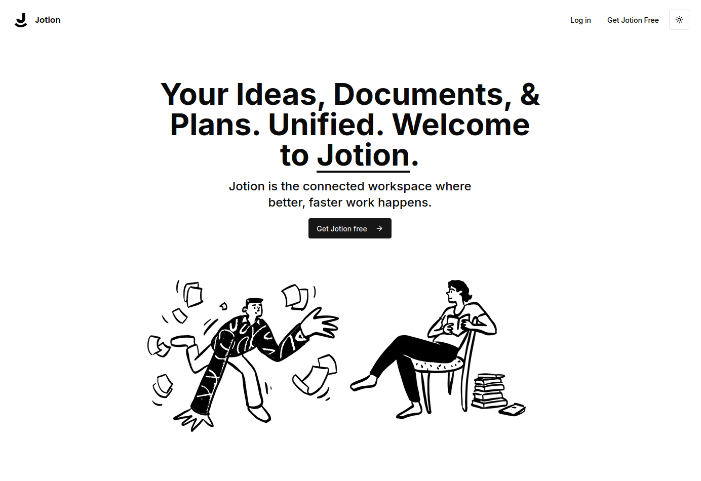
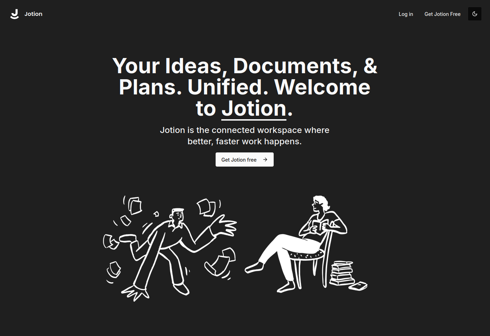
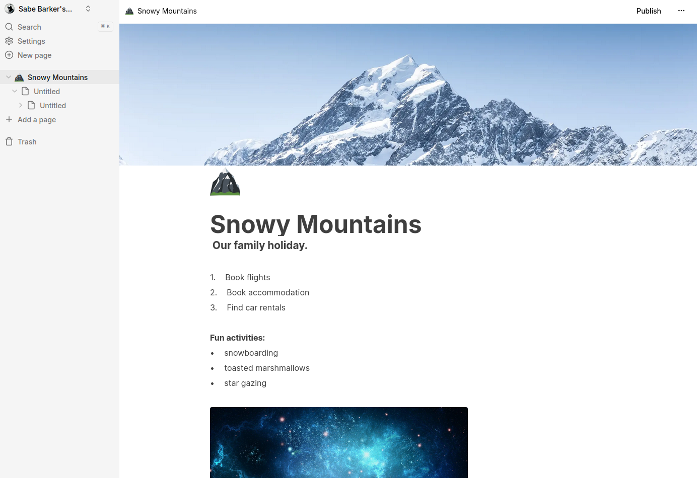
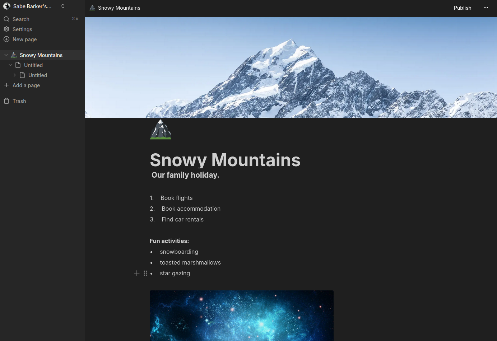

#  Jotion

## A fullstack Notion clone.

**Landing Page (Light mode):**

**Landing Page (Dark mode):**

**Application (Light Mode):**

**Application (Dark mode):**

## Getting Started

1. Clone this repository:

   ```bash
   git clone git@github.com:domdechiera/jotion.git
   ```

   

2. Install dependencies:

   ```bash
   npm install
   ```

4. Rename `.env-example` to `.env` and fill in your API keys:

   ```bash
   # Deployment used by `npx convex dev`
   CONVEX_DEPLOYMENT=
   
   NEXT_PUBLIC_CONVEX_URL=
   
   # Clerk
   NEXT_PUBLIC_CLERK_PUBLISHABLE_KEY=
   CLERK_SECRET_KEY=
   
   # Edgestore
   EDGE_STORE_ACCESS_KEY=
   EDGE_STORE_SECRET_KEY=
   ```

5. Run Convex development server:

   ```bash
   npx convex dev
   ```

6. Run the development server:

   ```bash
   npm run dev
   ```

Open [http://localhost:3000](http://localhost:3000) with your browser to see the result.

## The Stack

This is a [Next.js](https://nextjs.org/) project bootstrapped with [`create-next-app`](https://github.com/vercel/next.js/tree/canary/packages/create-next-app).

This project utilises the following third-party tools:

- [TypeScript](https://www.typescriptlang.org/) - JavaScript with syntax for types.
- [Tailwind CSS](https://tailwindcss.com/) - Rapidly build modern websites without ever leaving your HTML.
- [shadcn/ui](https://ui.shadcn.com/) - Beautifully designed components that you can copy and paste into your apps.
- [Lucide](https://lucide.dev/) - Beautiful and consistent icons.
- [Vercel](https://vercel.com) -  Build, scale, and secure a faster, more personalised web.
- [Clerk](https://clerk.com) - Authentication and user management.
- [Convex](https://convex.dev) - A fullstack TypeScript development platform.

## Deploy on Vercel

The easiest way to deploy this app is to use the [Vercel Platform](https://vercel.com/new?utm_medium=default-template&filter=next.js&utm_source=create-next-app&utm_campaign=create-next-app-readme) from the creators of Next.js.

Check out our [Next.js deployment documentation](https://nextjs.org/docs/deployment) for more details.

---

Looking to learn how to code? Check out [Code with Antonio](https://www.codewithantonio.com/).
